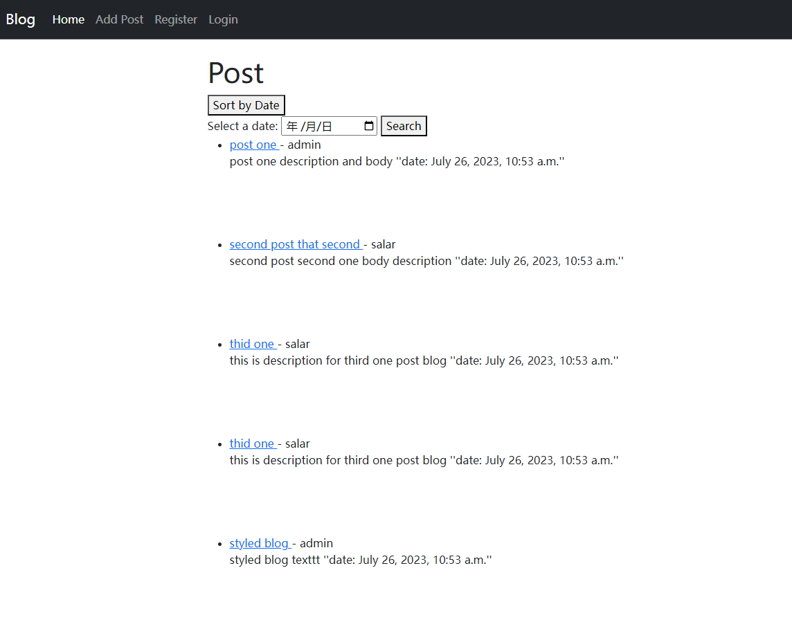
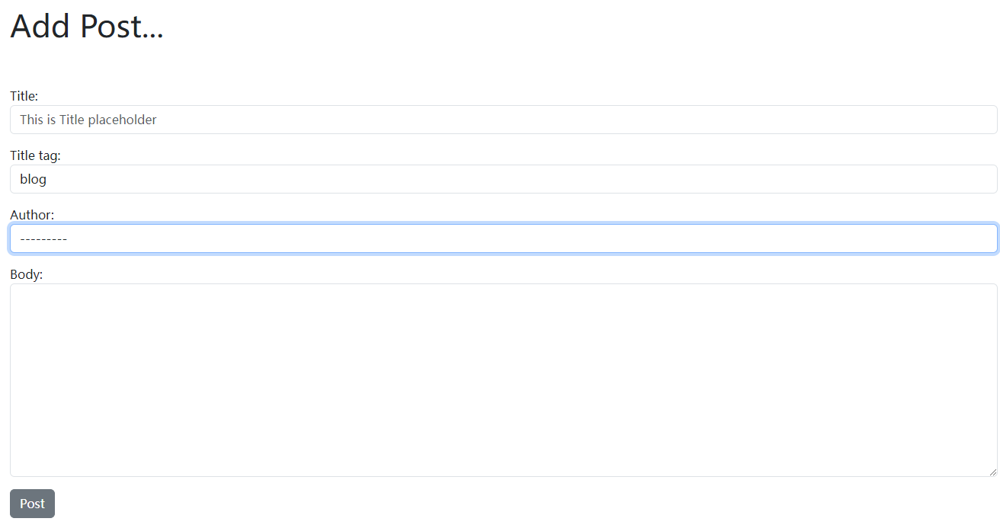
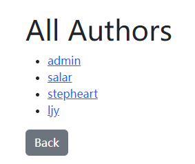
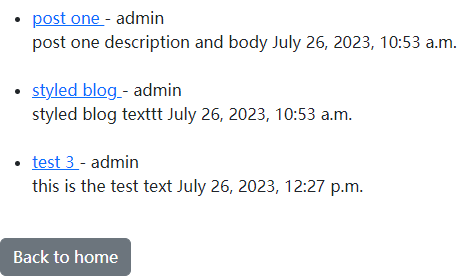
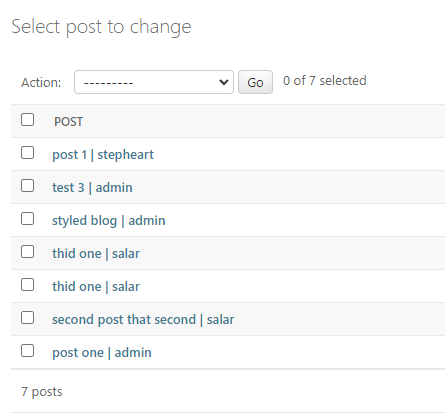
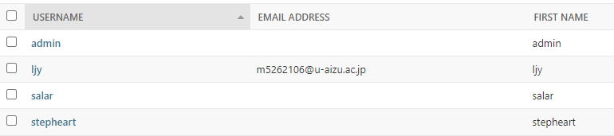

# my_blog



## Functions

1. To add posts, the title, name of the post and the content of the post will be displayed on the home page.

   
2. Display all the blog posts sorted by date (the last post is displayed first).
3. Select a certain date in the calendar and display all the posts written on this day.
4. Register in the system with the unique user name and password

   ## the bottom of the home page
5. Display the list of authors.

   
6. Show only the blog posts composed by the given author.

   

   # database schema

   

   In this module ,all the articles in the database that are displayed on the home page.

   

These users are the authors I can choose from when I post articles.

## Code

*Because this is the first html file I've ever completed*

```




    <h1> Post</h1>

    <!-- Add a button to sort posts by date -->
    <form action="" method="get">
        <button type="submit">Sort by Date</button>
    </form>

    <form action="" method="get">
        <label for="selected_date">Select a date:</label>
        <input type="date" id="selected_date" name="selected_date">
        <button type="submit">Search</button>
    </form>

    <ul>
    
        <li>
            <a href=>
                {{ post.title }}
            </a>
            - {{ post.author.first_name }}
            <br />
        {{ post.body }} ''date:
        {{ post.pub_date }}''</li>
        <br />
        <br />
        <br />
        <br />
    
    </ul>

    <a href="">View All Authors</a>


```

1. I can do what I want to do with the button.
2. I can click on the text to jump to the web page
